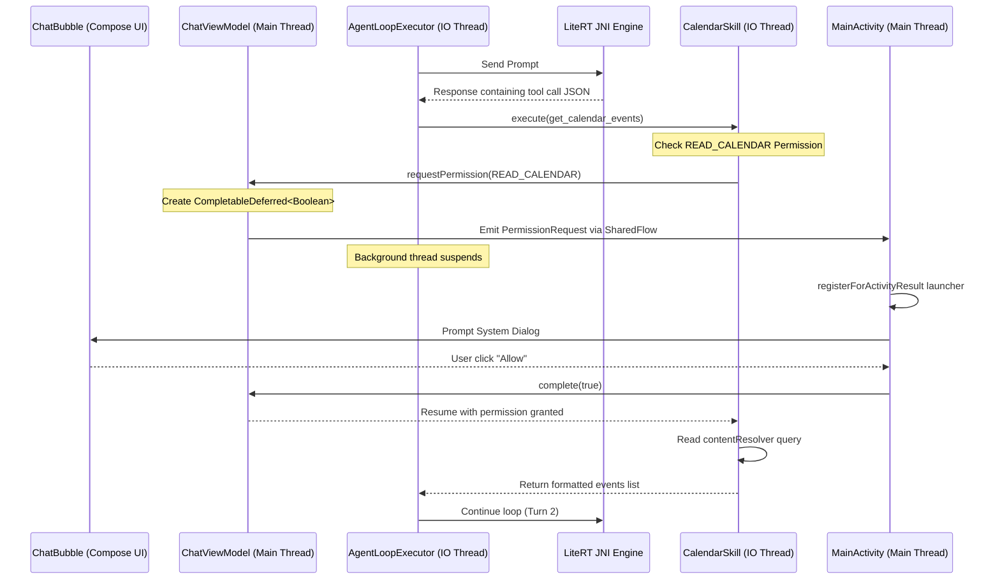

# Kosh Agent Loop & Skills Architecture

Kosh features an offline-first, strictly private on-device **Agent Loop & Skills framework** (both Native and JavaScript WebView-based) built on top of Jetpack Compose and local LiteRT JNI inference. This document details the technical design, dynamics of just-in-time runtime permissions, reflective suspend-function execution, and UI safety boundaries.

---

## 1. System Architecture overview

The Agentic System consists of three main components coordinating asynchronously:
1. **`AgentLoopExecutor`:** Manages multi-turn LLM reasoning loops. It parses tool calls from model outputs, executes them against registered skills, and appends outputs to the conversation thread to feed back to the model.
2. **`Skill` / `NativeSkillWrapper`:** Abstract interfaces representing execution capabilities. In order to avoid introducing the heavy `kotlin-reflect` dependency to the production APK, we employ JVM Java reflection to inspect methods and arguments at runtime.
3. **`PermissionRequester`:** Bridging interface between background execution threads and the UI layer to resolve Android runtime permissions just-in-time.



---

## 2. Dynamic Just-in-Time Runtime Permissions

Standard Android permissions are usually requested upfront during application startup, which degrades the user experience. Kosh employs a **suspending bridge pattern** to ask for sensitive permissions (like `READ_CALENDAR`) *at the exact moment* a tool call is executed.

### CompletableDeferred Suspension
Because model inference runs off the Main thread on a background dispatcher (`safeIoDispatcher`), we can suspend the execution of the agent loop cleanly using Kotlin's `CompletableDeferred<Boolean>`.
1. The background thread calls `permissionRequester.requestPermission(permission)`.
2. The implementation in `ChatViewModel` creates a `CompletableDeferred<Boolean>` and emits a `PermissionRequest` wrapper over a `MutableSharedFlow`.
3. The background thread blocks on `deferred.await()`, suspending without consuming CPU threads.
4. `MainActivity` collects the flow on the Main thread and launches the permission contract using `registerForActivityResult`.
5. When the result returns, the activity completes the deferred value, safely resuming the background loop.

### Lifecycle & Configuration Changes Resilience
If the user rotates the screen or backgrounds the app while the permission dialog is visible:
* `MainActivity` is destroyed and recreated.
* Standard callbacks would leak or leave the background thread suspended indefinitely.
* Because Kosh uses `registerForActivityResult` bound to `onCreate`, Android preserves the pending contract's target state. When the activity is restored, the result is captured and routed correctly, resuming the thread.

---

## 3. Reflective Suspend-Function Execution

To implement native skills, developers can write simple class methods annotated with `@Tool` and `@ToolParam`. The framework handles mapping the parameters and calling the methods reflectively.

### Kotlin Suspend Function Signature
Kotlin compile-time `suspend` functions are converted to standard Java bytecode methods with an extra parameter at the end: `kotlin.coroutines.Continuation`.
If standard reflection `Method.invoke()` is called with `null` as the continuation parameter, the coroutine state machine will throw a `NullPointerException` when trying to suspend or resume.

### Intrinsic Suspension Wrapper
To solve this cleanly without adding `kotlin-reflect` dependencies, `NativeSkillWrapper` implements an intrinsic suspension mechanism:
1. We detect if the method is a suspend function by checking if the last parameter type is assignable from `kotlin.coroutines.Continuation`:
   ```kotlin
   val isSuspend = paramTypes.isNotEmpty() && 
       kotlin.coroutines.Continuation::class.java.isAssignableFrom(paramTypes.last())
   ```
2. If it is a suspend function, we execute the reflection call inside Kotlin's `suspendCoroutineUninterceptedOrReturn`:
   ```kotlin
   val result = if (isSuspend) {
       suspendCoroutineUninterceptedOrReturn { cont ->
           argValues[argValues.size - 1] = cont
           try {
               val res = method.invoke(instance, *argValues)
               if (res == kotlin.coroutines.intrinsics.COROUTINE_SUSPENDED) {
                   kotlin.coroutines.intrinsics.COROUTINE_SUSPENDED
               } else {
                   res
               }
           } catch (e: Exception) {
               throw e.cause ?: e
           }
       }
   } else {
       method.invoke(instance, *argValues)
   }
   ```
3. This passes the caller's actual continuation context. If the JNI execution or permission request suspends, it propagates the suspension cleanly and resumes once the result is ready.

---

## 4. UI Settings Deep Link Shortcut

If the user permanently denies a runtime permission (checking "Don't ask again"), future attempts to request the permission via `ActivityResult` return `false` instantly without showing a dialog. The tool execution fails with a permission denied message.

* **Rephrasing Handler:** The model receives the raw error (e.g. `"Error: READ_CALENDAR permission denied. Tell the user to enable calendar permissions in Android settings."`).
* **Trigger Condition:** In [ChatBubble.kt](file:///d:/Work/Testbench/temp/app/src/main/java/com/rajpawardotin/kosh/ui/components/ChatBubble.kt), the bubble scans the AI text message case-insensitively for the keywords `"permission"` or `"denied"`.
* **Shortcut Button:** If matched, the UI displays a clean, glassmorphic button labeled **"Open App Permissions Settings"**. Clicking this button executes an Android system intent to deep link directly to the app info settings page of Kosh:
  ```kotlin
  val intent = Intent(Settings.ACTION_APPLICATION_DETAILS_SETTINGS).apply {
      data = Uri.fromParts("package", context.packageName, null)
  }
  context.startActivity(intent)
  ```
  This resolves the dead-end UX block, giving the user a direct, convenient way to restore functionality.

---

## 5. WebView Sandbox & Infinite Loop Guards

### Headless WebView Execution
To support custom JS skills/plugins safely, `JsSkillExecutor` evaluates scripts on a headless WebView instance. Since WebViews can only be manipulated on the Android UI Thread, the evaluation hops to `Dispatchers.Main` and suspends:
* It sets up a timeout guard (5 seconds). If the script hangs or runs into infinite recursion, the coroutine is cancelled and the WebView is reset, preventing resource exhaustion.

### Agent Loop Halted Guards
A runaway loop of tool invocations (where the model keeps calling tools in a circle) is prevented by setting a hard limit:
```kotlin
const val MAX_AGENT_TURNS = 5
```
If the model does not produce a final answer within 5 turns, the agent execution is forcefully terminated with a halt signature, returning the conversation back to standby.
