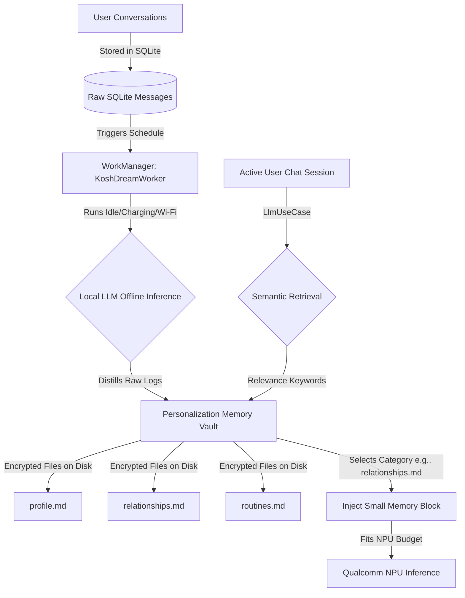

# Kosh Android Personalization Engine (Architecture Concept)

This document presents the design and architectural blueprint for building a private, secure, and resource-efficient **On-Device Personalization Engine** in Kosh. Inspired by the persistent memory models and asynchronous orchestration patterns of state-of-the-art agent systems like Claude Code, this concept is custom-tailored to the hard constraints of offline Android environments (specifically the 2382-token limit of Qualcomm NPUs).

---

## 1. Context & Hardware Constraints

Running local LLMs on Android devices presents two conflicting forces:
1. **The Personalization Goal**: To feel truly personalized, a local assistant must know the user's habits, relationships, routines, and preferences across all conversation sessions.
2. **The NPU Token Limit**: The Qualcomm NPU compiled models in Kosh have a strict context limit of **2382 tokens** (approx. 5500 characters). 

### Why Current Architectures Fail on Mobile:
- **Sliding Chat History + Global Context Bloat**: If a sliding window of recent messages is combined with a flat list of extracted facts, the context size quickly overflows, causing JNI/inference crashes.
- **Session Isolation**: Facts in Kosh are currently stored in a session-specific column (`facts` and `summary` in the `sessions` table of [KoshDatabaseHelper.kt](file:///d:/Work/Testbench/temp/app/src/main/java/com/rajpawardotin/kosh/data/KoshDatabaseHelper.kt)), preventing cross-session learning (e.g., knowing the user's name or preferences when they open a new chat).
- **Inline Latency**: Running fact extraction and summarization prompts immediately after a response finishes increases battery drain, creates CPU/GPU thread contention, and can be aborted if the user sweeps the app away.

---

## 2. The Solution: Asynchronous Personalization Architecture

By separating memory extraction and consolidation from the active chat loop, Kosh can run deep reflection routines in the background when the phone has abundant resources.



### Core Architecture Components:

### A. The "Dreaming" Background Worker (`KoshDreamWorker`)
Instead of extracting facts inline, Kosh delegates this work to Android's `WorkManager`.
- **Trigger Conditions**: Run daily or after 5 new conversation sessions. The worker executes only when:
  - The device is **charging** (prevents active battery drain).
  - The device is **idle** (avoids UI/input thread lag).
  - Optionally connected to **Wi-Fi** (though local LLM runs completely offline).
- **Inference Lifecycle**:
  - The worker spins up the local model via [LiteRTModelProvider](file:///d:/Work/Testbench/temp/app/src/main/java/com/rajpawardotin/kosh/data/LiteRTModelProvider.kt) in a low-priority, single-threaded background state.
  - It reads new raw chat logs from SQLite since the last consolidation check.
  - It runs a multi-step **"Dreaming" Prompt** to distill, deduplicate, and merge new user facts into the long-term profile.

### B. Encrypted Memory Vault & Taxonomy
Instead of storing facts in a flat, unstructured text column, Kosh maintains a **Personalization Memory Vault** stored in the secure app data directory (`context.filesDir/personalization/`), encrypted using Android Keystore / Tink:
- **`profile.md`**: User identity, profession, language preferences, goals, and conversational tone feedback (e.g. "prefers direct answers").
- **`relationships.md`**: Key people in the user's life (family, friends, colleagues), their birthdays, and key interactions.
- **`routines.md`**: Habits, sleep/wake cycles, diet preferences, workout routines.
- **`knowledge.md`**: Long-term declarative facts (favorite books, recipe notes, recurring reminders).

### C. Selective Context Injection (Budget-Aware RAG)
To respect the NPU's 2382-token limit, Kosh's [LlmUseCase.kt](file:///d:/Work/Testbench/temp/app/src/main/java/com/rajpawardotin/kosh/domain/usecase/LlmUseCase.kt) will dynamically inject *only the relevant sub-profile* instead of the entire personalization file.
- **Heuristic Classifier**: A lightweight regex/keyword classifier runs on the user's input query.
  - *Example*: User types: *"What should I get my sister for her birthday?"* -> Heuristic flags "sister" and "birthday" -> Classifies to `relationships.md`.
  - *Result*: Only the contents of `relationships.md` (which are small and highly focused) are read, decrypted, and injected into the prompt. The context footprint remains under 500 characters, leaving the rest of the 5500-character budget for sliding conversation window history and generation.

---

## 3. SQLite Schema Extensions (v9)

To support global, cross-session personalization while maintaining strict session encryption keys, we introduce a new table schema:

```sql
-- Table mapping global personalization documents
CREATE TABLE personalization_vault (
    category_id TEXT PRIMARY KEY,   -- 'profile', 'relationships', 'routines', 'knowledge'
    encrypted_content TEXT,          -- Tink AEAD encrypted markdown structure
    last_updated INTEGER
);
```

### Encryption Key Management:
- Global personalization files are encrypted using a **Master Personalization Key** stored in the Android Keystore (`KeyStore`).
- Unlike chat sessions (which can be locked behind custom user-chosen passwords), the personalization vault is bound to the device's biometric authentication key, ensuring seamless background decryption by `WorkManager` when biometrics are authenticated, or protected under a fallback application master key.

---

## 4. User Privacy & Control UI ("Memory Vault")

Privacy-first design requires that the user remains in complete control of what Kosh remembers about them. 

### Jetpack Compose UI Flow:
1. **The Vault Screen**: A dedicated settings screen showing cards for each memory category (e.g. "Identity & Preferences", "My Circle", "My Routines").
2. **Biometric Guard**: Accessing or editing the vault requires a biometric authentication check (leveraging Kosh's `DeleteSessionDialog` security logic).
3. **Editable Nodes**: The user can view the distilled markdown memory files, edit sentences, or delete rows.
   - *Example*: If Kosh incorrectly extracts *"User hates chocolate"* during a sarcastic exchange, the user can tap and delete that fact.
4. **"Forget Me" Option**: A single-button action that wipes `personalization_vault` completely and rotates Keystore keys.

---

## 5. Summary of Architectural Goldmine Advantages

1. **Unlocks Cross-Session Continuity**: Kosh transitions from a series of disconnected chat histories into a singular, unified assistant that grows with the user.
2. **Defeats Qualcomm NPU Limits**: Distilling raw logs into topic files and using categorical RAG guarantees that personalization context size is kept minimal, protecting the system from JNI/NPU OOM crashes.
3. **Optimized Power and Compute**: Background consolidation offloads heavy reasoning to idle times when the phone is plugged in, maintaining maximum UI fluidness during live chats.
4. **Absolute Privacy First**: The personalization files are encrypted locally with the hardware-backed keystore, never leaving the user's physical device.
