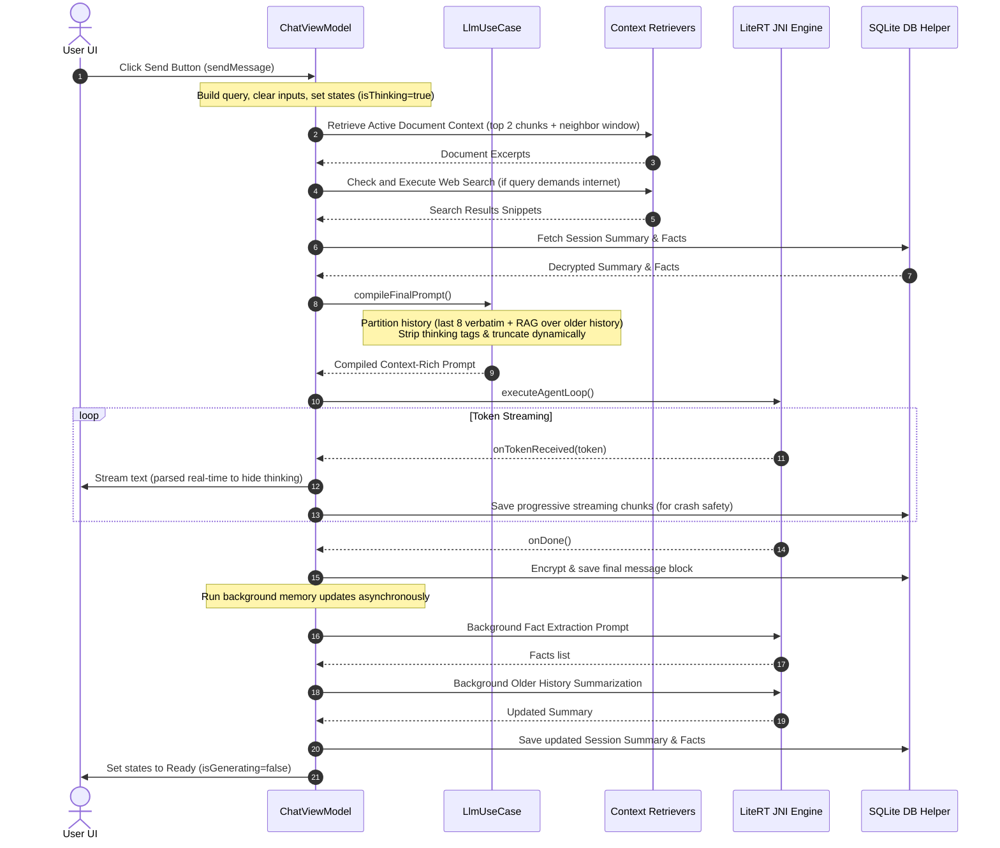

# Kosh Chat Execution Flow & Lifecycle

This document explains the step-by-step lifecycle of a chat query in Kosh, starting from the millisecond the user presses the **Send** button in the UI, through prompt compilation and LiteRT JNI streaming, up to background memory and database updates.

---

## 1. Sequence Diagram



---

## 2. Step-by-Step Lifecycle

### Step 1: User Actions & UI Invocation
When the user types a query and clicks the **Send** button:
1. `ChatInput.kt` triggers its `onSend` callback: `viewModel.sendMessage(context)`.
2. The UI switches state immediately:
   - Sets the input field text to empty (`prompt = ""`).
   - Toggles state indicators: `isGenerating = true`, `isThinking = true`, and `agenticStateLabel = "Initializing..."`.

---

### Step 2: ViewModel Initialization
In `ChatViewModel.sendMessage(context)`:
1. Resolves/generates the unique `sessionId` if it's a new conversation.
2. Formats any document attachment tags (if files are attached but text is blank, it defaults to a summarization prompt like `"Summarize the attached document: file.pdf"`).
3. Constructs a new user `ChatMessage` and adds it in-memory to the observable state list `chatMessages` (which immediately updates the UI layout scroll-to-bottom and reverses layout to index 0).
4. Launches a coroutine in `viewModelScope` on the `safeIoDispatcher` (handling thread safety and errors).

---

### Step 3: Context Retrieval (Files, Web Search, Database)
Before prompt compilation, the coroutine retrieves three sources of context:
1. **Document Context**: Calls `retrieveContext(...)` which queries FTS4 for matching document chunks. In-memory, it ranks terms using a custom TF-IDF keyword overlap calculation, retrieves the top 2 matching chunks, fetches neighboring chunks (index - 1 and index + 1) for reading context flow, and sorts them chronologically.
2. **Web Search**: Scans the prompt for web/search keywords (e.g., "google", "weather today", "recent") or URLs. If triggered, sets `isSearchingInternet = true` and `agenticStateLabel = "Searching the web..."`, retrieves snippets via `Brave` or `Tavily` APIs, then clears the state.
3. **Session Memory**: Queries the SQLite database to fetch the active `ChatSession` (which holds the running conversation summary and extracted facts profile).

---

### Step 4: Prompt Compilation (`LlmUseCase.compileFinalPrompt`)
The view model passes the message history, document context, web search snippets, running summary, and facts list to the domain use case.
1. **Budget Calculation**: Checks the remaining character budget:
   `budget = maxContextChars (8000) - prompt.length - docContext.length - searchResults.length - summary.length - facts.length - 1500`.
2. **History Partitioning**:
   - **Sliding Verbatim Window**: Takes the last 8 turns from the history to include verbatim.
   - **Older History Semantic Search**: Searches the remaining older messages using `searchHistoryMessages` (token-overlap keyword search) to find the top 2 relevant turns.
3. **Thinking Tag Stripping**: For all retrieved Assistant history messages, it strips `<thinking>...</thinking>` and ````thinking```` code blocks to prevent small on-device models (Gemma 2B) from getting confused by historical XML delimiters.
4. **Graceful Truncation**: If any history turn exceeds the remaining budget, it truncates the turn and appends `"... [truncated]"` instead of discarding the entire history.
5. **Prompt assembly**: Formats system instructions (injecting reasoning directives), user facts, conversation summaries, relevant past turns, sliding window verbatim history, and the current user query.

---

### Step 5: JNI LLM Execution & Token Streaming
1. Sets `isThinking = true` and `agenticStateLabel = "Thinking..."`.
2. Applies a brief artificial delay (400ms) to allow the "Thinking" visual pulse to settle organically.
3. Calls `AgentLoopExecutor.executeAgentLoop` to initialize the JNI inference pipeline:
   - Manual load order check for libraries (`libLiteRt.so`, `libQnnSystem.so`, `libQnnHtp.so`, etc.) if Qualcomm NPU is selected.
   - Writes the `engine_crashed = true` sentinel database entry to intercept crashes, clearing it upon JNI return.
4. Runs JNI generation and receives streamed tokens back:
   - Sets `agenticStateLabel = "Formatting response..."` on the first received token.
   - Progressively appends tokens to `currentResponseChunk` and updates `tokensPerSecond` metric.
   - Compares chunks against repetition patterns to halt loops if the model gets stuck.
   - **Real-Time Stripping**: The UI `ThinkingIndicator` intercepts `currentResponseChunk` in real-time, parsing it with `ResponseParser.parseStreamState(...)` to separate and hide the raw thinking process, rendering a clean "Thinking..." card while generating and streaming the clean output below it with a static `▊` terminal cursor.
   - **Crash-Safety Saves**: Saves progressive chunks into SQLite (`messageRepository.saveMessage`) during execution to preserve progress if the OS kills the process.

---

### Step 6: Completion & Asynchronous Memory Updates
When JNI signals completion (`onDone`):
1. Persists the final full Assistant response (encrypting the text and referenced source documents if the session is locked).
2. Clears the streaming UI text buffers and sets `isThinking = false`.
3. Triggers `runBackgroundMemoryUpdates` asynchronously on the background dispatcher:
   - **Fact Extraction**: Submits the latest exchange to the LLM: `"Extract key user preferences, facts... from this interaction"`, parses output, merges it with the session's existing profile, and saves to the SQLite `sessions` table.
   - **Rolling Summarization**: If the chat exceeds 10 turns, passes the older history (excluding sliding window) and current summary to the LLM to update the running context, storing it back to the database.
4. Updates the session's `lastActive` time and `lastSearchQuery` fields.
5. Clears generation flags, returning states to `Ready`.
