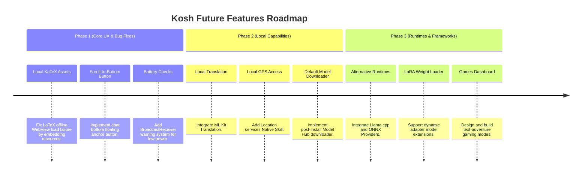

# Kosh Future Planning: Analysis and Technical Breakdown

This document provides a complete transcription, code-level analysis, and architectural roadmap for the features outlined in the Kosh future planning notes.

---

## 1. Transcription of Notes

Below is the verbatim transcription of the handwritten notes grouped by source image.

### Image 1: Engine & Models Roadmap
*   `[ ] Support other than LiteRT as well.`
*   `[ ] Add image gen models.`
*   `[ ] Add LoRA models.`
*   `[ ] Debug web search glitches.`
*   `[ ] Maybe remove the web search functionality [think how it can be implemented].`
*   `[ ] Generate different logo ideas based on this starting point.` (References a hand-drawn sketch of a cloud encircling a core emblem).
*   `[x] Response markdown does not display LaTeX code or mathematical expressions.` (Continued in Image 2; Basic Markdown added, local KaTeX offline bundle planned).

### Image 2: UX, Offline Tasks & Utilities
*   `[x] Response markdown does not display LaTeX code or mathematical expressions.` (Basic Markdown added, local KaTeX offline bundle planned).
*   `[x] Instant scroll to bottom in chat button.`
*   `[ ] Add games chat dashboard in dashboard home-screen.`
*   `[ ] Offline tasks:`
    *   `-> (1) Translation`
    *   `-> (2) GPS access locate yourself`
    *   `-> (3) [Identify offline scope]`

### Image 3: Target: Offline & Efficiency
*   `TARGET USER'S OFFLINE` (Header in red box).
*   `[ ] Minimum how to support. How to optimize for minimum requirement.`
*   `[ ] By default small inbuilt model.`
    *   `[ Challenge: How to be small & also provide basic inbuilt proper model? ]`
*   `[x] Battery less than 20%...` (Continued in Image 4).

### Image 4: Power Management & Feature Demos
*   `[x] Battery less than 20%, show notification that the app will drain faster battery. Avoid longer usage after 15% battery usage.`
*   `[ ] List all tasks that Kosh is actually able to perform.`
*   `[ ] Make feature videos: major ones, list all use cases & then group them to show for the use case video.`

---

## 2. Technical Codebase Analysis & Recommendations

### Theme A: Model Frameworks & On-Device Runtimes

#### 1. Support Other Than LiteRT
*   **Current State:** `LiteRTModelProvider` implements [AIProvider](file:///d:/Work/Testbench/temp/app/src/main/java/com/rajpawardotin/kosh/domain/provider/AIProvider.kt), wrapping TensorFlow Lite's local LLM inference engines.
*   **Proposed Solution:** Build alternative implementations of `AIProvider` to abstract different runtimes:
    *   **Llama.cpp JNI Wrapper:** High performance on CPUs and GPUs via Vulkan/OpenCL; wider model compatibility (GGUF format).
    *   **ONNX Runtime Mobile:** Native compatibility with ONNX models, leveraging NNAPI and custom Qualcomm DSP execution providers.
    *   **MediaPipe LLM Inference:** Native Android API designed for Gemma, Phi, and Llama 2 models.
*   **Architectural Change:** Update the dependency injection layer in [MainActivity.kt](file:///d:/Work/Testbench/temp/app/src/main/java/com/rajpawardotin/kosh/MainActivity.kt) to load the appropriate `AIProvider` based on the user's selected model format.

#### 2. Image Generation Models (On-Device)
*   **Engineering Challenge:** Text-to-image models (e.g., Stable Diffusion 1.5, SDXL Turbo) are extremely heavy, requiring at least 1.5GB to 4GB of RAM and massive GPU resources.
*   **Implementation Path:** 
    *   Use **ONNX Runtime Mobile** or **MLC LLM** to run a highly quantized image generation model (e.g., Stable Diffusion Nano, Mobile Diffusion, or a tiny GAN).
    *   Expose a dedicated native agent skill: `ImageGenerationSkill` that intercept inputs starting with "/draw" or "/image" to trigger the text-to-image engine.

#### 3. LoRA Weight Support
*   **Engineering Challenge:** Currently, LiteRT does not native-compile dynamic LoRA weight updates on Android NPU backends easily.
*   **Implementation Path:** Transition to **Llama.cpp JNI** or **ONNX GenAI**, which natively support dynamic loading of adapter weights at runtime. The app's staging area (`files/models`) can store `.lora` files and pass them as engine-level initialization configuration.

#### 4. Default Small Inbuilt Model
*   **The Challenge:** A standalone 1B parameter model is ~700MB-1GB when quantized (Q4_K_M). Including this inside the initial APK would exceed the Google Play Store's 150MB direct download limit.
*   **Proposed Solution:**
    *   Implement an on-demand **dynamic delivery module** or **post-install download manager** inside the Model Hub.
    *   Provide a default recommended model download selection: **Llama-3.2-1B-Instruct** or **Qwen-2.5-1.5B-Instruct** (quantized via LiteRT or GGUF).

---

## Theme B: UI & UX Enhancements

#### 1. LaTeX Mathematical Typesetting (Offline Bug)
*   **Current Bug:** [MathFormulaCard.kt](file:///d:/Work/Testbench/temp/app/src/main/java/com/rajpawardotin/kosh/ui/chat/components/MathFormulaCard.kt) loads the KaTeX JS and CSS stylesheet from `https://cdn.jsdelivr.net/npm/katex@0.16.8/dist/`. Since Kosh is an offline-first app, this WebView fails to render formulas when the device has no internet access.
*   **Proposed Fix:**
    1.  Download KaTeX assets (`katex.min.js`, `katex.min.css`, and related `.woff2` font files).
    2.  Place them inside the `app/src/main/assets/katex/` folder.
    3.  Modify `MathFormulaCard.kt` to load KaTeX resources locally:
        ```html
        <link rel="stylesheet" href="file:///android_asset/katex/katex.min.css">
        <script src="file:///android_asset/katex/katex.min.js"></script>
        ```
    4.  Update the `WebView` call: `loadDataWithBaseURL("file:///android_asset/", html, "text/html", "UTF-8", null)`.

#### 2. Instant Scroll to Bottom Button in Chat
*   **Current State:** The messages list inside [ChatScreen.kt](file:///d:/Work/Testbench/temp/app/src/main/java/com/rajpawardotin/kosh/ui/chat/ChatScreen.kt) is a `LazyColumn` with `reverseLayout = true`, meaning index `0` represents the visual bottom (most recent message).
*   **Proposed Solution:**
    *   Add a state tracking variable: `val showScrollToBottom by remember { derivedStateOf { scrollState.firstVisibleItemIndex > 0 } }`.
    *   Overlay a Floating Action Button (FAB) or a sleek down-arrow button when `showScrollToBottom` is `true`.
    *   Clicking the button will fire:
        ```kotlin
        coroutineScope.launch {
            scrollState.animateScrollToItem(0)
        }
        ```

#### 3. Games Dashboard on Home-Screen
*   **Concept:** Integrate local LLM-powered games directly onto the dashboard home screen.
*   **Proposed Solution:**
    *   Create a "Games Hub" section within [DashboardScreen.kt](file:///d:/Work/Testbench/temp/app/src/main/java/com/rajpawardotin/kosh/ui/components/DashboardScreen.kt).
    *   Provide cards for pre-configured prompt scripts (e.g., "Choose Your Own Adventure", "Trivia", "20 Questions").
    *   When selected, the system initializes a chat session using a specialized game system prompt.

---

## Theme C: Web Search Engineering

#### 1. Re-Evaluating Web Search
*   **Conflict:** Web search (Google/Bing/DDG scrapers in [SearchProviderImpl.kt](file:///d:/Work/Testbench/temp/app/src/main/java/com/rajpawardotin/kosh/data/SearchProviderImpl.kt)) violates the "offline-first, strictly private" promise of Kosh by communicating with search engine web servers. Furthermore, HTML web scraping is highly fragile and prone to IP blocks/CAPTCHAs.
*   **Proposed Alternatives:**
    *   **Graceful Degradation:** Check network connectivity before starting search. If offline, automatically hide/disable the web search toggle.
    *   **Local Search Indexing (Semantic RAG):** Refuse external search and instead rely on full-text indexation (`SQLite FTS4`) of user-attached files, offline books, or local cached data.
    *   **Tor/Proxy Integration:** Route external searches through Tor (Orbot integration) or a private proxy to prevent IP leaks.

---

## Theme D: Offline Tasks & Resource Management

#### 1. Translation & GPS (Offline Scope)
*   **Local Translation:** Rather than calling online translators, leverage Google's **ML Kit On-Device Translation API** (which downloads language models locally to the device).
*   **Local GPS Access:** Implement a native skill `LocationSkill` that accesses the device's GPS chip using `FusedLocationProviderClient`. This allows the LLM to get coordinates, query a local SQLite lookup database of cities/timezones, and know the user's location without fetching external APIs.

#### 2. Battery Monitoring & Power Management
*   **Why it Matters:** Local LLM generation is CPU/GPU/NPU intensive and heavily drains mobile battery.
*   **Proposed Implementation:**
    *   Register a `BroadcastReceiver` in the application context listening to `Intent.ACTION_BATTERY_CHANGED`.
    *   Provide a utility flow `batteryLevel: Flow<Int>` that checks the current battery percentage and charge state.
    *   **Alert Rules:**
        *   **Less than 20%:** Show a persistent banner in `ChatScreen` warning that local AI usage drains battery faster.
        *   **Less than 15%:** Prevent heavy NPU/GPU generation loops or warn the user with a dialog recommending plugged-in usage.

---

## 3. Recommended Implementation Roadmap


